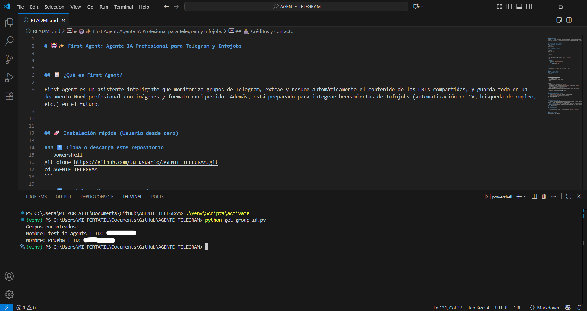
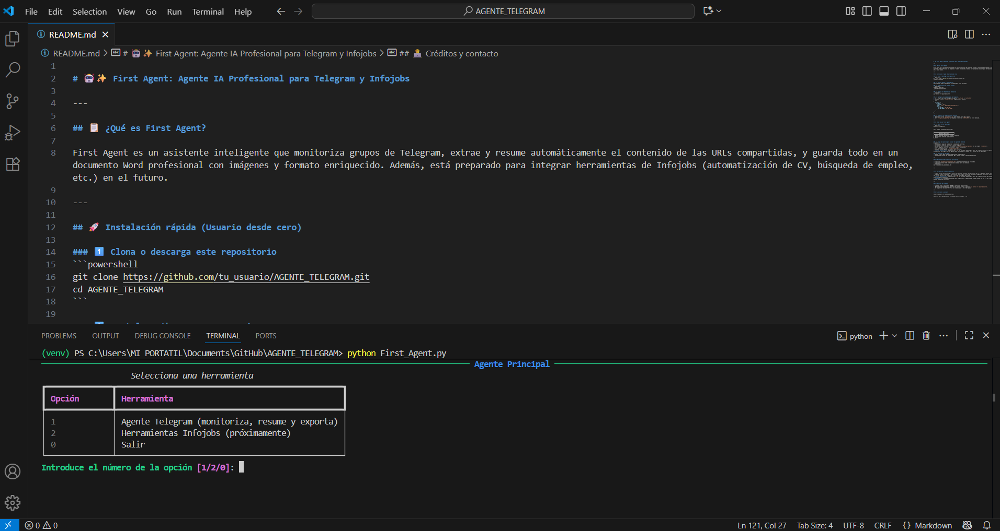
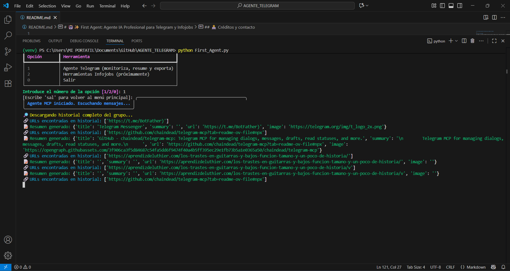
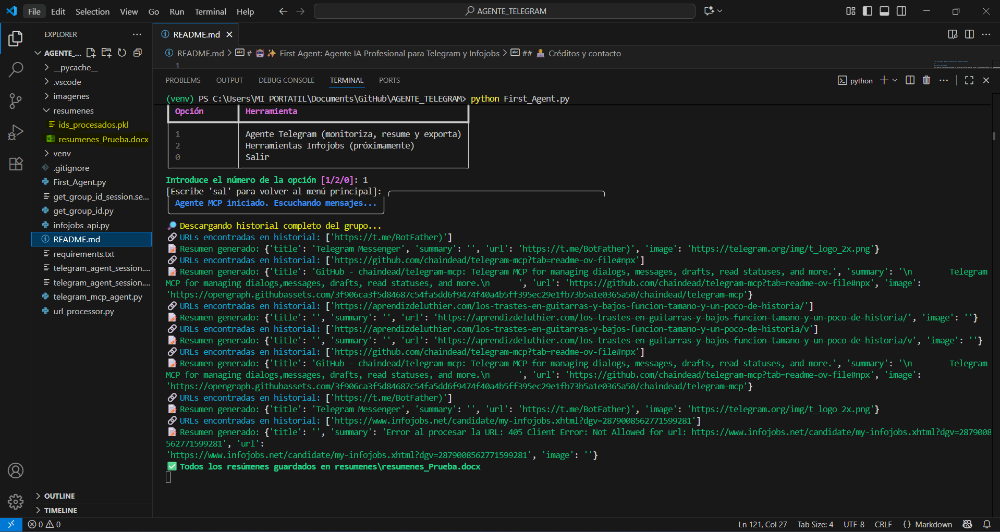
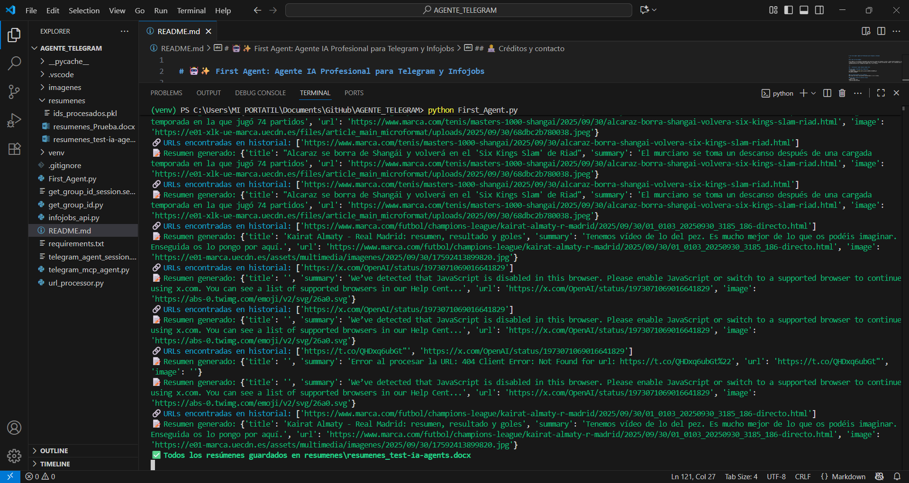
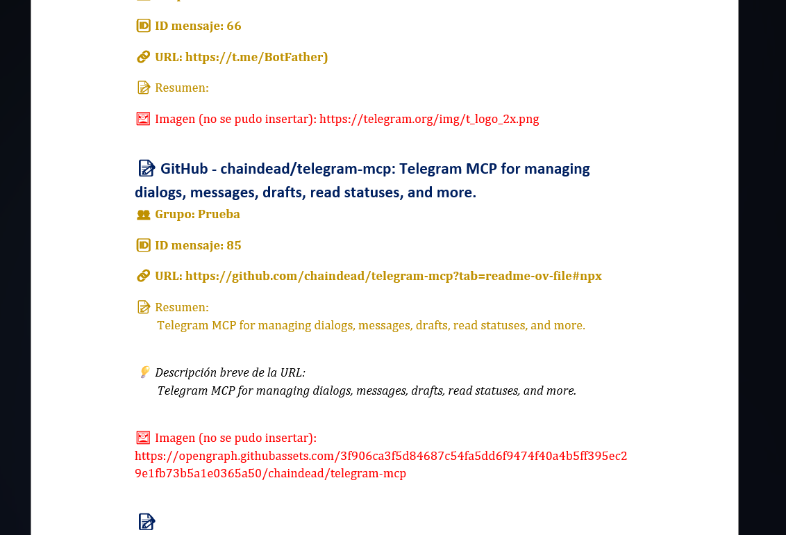

# 🤖✨ First Agent: Agente IA Profesional para Telegram y Infojobs

---

## 📋 ¿Qué es First Agent?

First Agent es un asistente inteligente que monitoriza grupos de Telegram, extrae y resume automáticamente el contenido de las URLs compartidas, y guarda todo en un documento Word profesional con imágenes y formato enriquecido. Además, está preparado para integrar herramientas de Infojobs (automatización de CV, búsqueda de empleo, etc.) en el futuro.

---


> ⚠️ **IMPORTANTE:** Antes de usar el agente, debes configurar tus claves personales de las APIs de Telegram e Infojobs en el archivo `.vscode/mcp.json`. Sin estas credenciales, el agente no funcionará correctamente.

## 🚀 Instalación rápida (Usuario desde cero)

### 1️⃣ Clona o descarga este repositorio
```powershell
git clone https://github.com/tu_usuario/AGENTE_TELEGRAM.git
cd AGENTE_TELEGRAM
```

### 2️⃣ Instala Python 3.12 o superior
Descárgalo de https://www.python.org/downloads/ si no lo tienes.

### 3️⃣ Crea y activa un entorno virtual
```powershell
python -m venv venv
./venv/Scripts/activate
```

### 4️⃣ Instala las dependencias necesarias
```powershell
pip install -r requirements.txt
```


### 5️⃣ Configura tus credenciales de Telegram e Infojobs

1. Ve a https://my.telegram.org y consigue tu `TG_APP_ID` y `TG_API_HASH`.
2. Si vas a usar Infojobs, entra en https://developer.infojobs.net/apps y crea tu aplicación para obtener `INFOJOBS_CLIENT_ID` y `INFOJOBS_CLIENT_SECRET`.
3. Edita el archivo `.vscode/mcp.json` siguiendo este ejemplo:
```json
{
  "servers": {
    "telegram": {
      "command": "npx",
      "args": ["-y", "@chaindead/telegram-mcp"],
      "env": {
        "TG_APP_ID": "TU_APP_ID",
        "TG_API_HASH": "TU_API_HASH"
      }
    },
    "infojobs": {
      "env": {
        "INFOJOBS_CLIENT_ID": "TU_CLIENT_ID",
        "INFOJOBS_CLIENT_SECRET": "TU_CLIENT_SECRET",
        "INFOJOBS_REDIRECT_URI": "http://localhost:8080/callback"
      }
    }
  }
}
```

### 6️⃣ Configura el ID del grupo de Telegram
1. Ejecuta el script `get_group_id.py` para obtener el ID de tu grupo.
2. Abre `telegram_mcp_agent.py` y reemplaza el valor de `GROUP_NAME` por el ID obtenido.

---

## 🏁 ¿Cómo se usa First Agent?

### 1️⃣ Lanza el menú principal
```powershell
python First_Agent.py
```

Verás un menú profesional y colorido:

```
╔══════════════════════════════════════╗
║         🤖 Agente Principal          ║
╚══════════════════════════════════════╝
1. Agente Telegram (monitoriza, resume y exporta)
2. Herramientas Infojobs (próximamente)
0. Salir
```


### 2️⃣ Elige la opción 1 para activar el agente de Telegram
El agente:
- Monitoriza el grupo en tiempo real y procesa el historial.
- Extrae URLs, resume su contenido y asocia imágenes.
- Guarda todo en un único Word profesional (`resumenes_{nombre_grupo}.docx` en la carpeta `resumenes`).
- Inserta imágenes, colores, emoticonos y formato enriquecido.
- Evita duplicados gracias a `ids_procesados.pkl`.
- Genera un resumen global diario y al salir (Ctrl+C).
- **Control interactivo:** Puedes escribir `sal` en cualquier momento para salir de la monitorización. Se mostrará un menú de confirmación (sí/no) para evitar salidas accidentales. Si eliges "no", el agente sigue funcionando; si eliges "sí", vuelves al menú principal.

### 3️⃣ Consulta los resúmenes
- Abre el archivo Word generado con Microsoft Word o similar.
- Cada entrada incluye: ID de mensaje, URL, resumen, imagen y formato profesional.

---

## 🛡️ Evita duplicados y gestiona el historial

- El archivo `resumenes/ids_procesados.pkl` almacena los mensajes ya procesados.
- Si quieres procesar todo el historial de nuevo, borra ese archivo:
```powershell
del .\resumenes\ids_procesados.pkl
```

---


## 🧩 Herramientas Infojobs (fase beta)

- El menú incluye una sección para futuras herramientas Infojobs: automatización de CV, búsqueda de empleo, actualización diaria, etc.
- Ya puedes probar la búsqueda y notificación automática de ofertas de empleo para ingenieros (eléctrico, electrónico, industrial, etc.) con 1 año o sin experiencia. Las ofertas se envían en tiempo real a tu grupo de Telegram de pruebas.
- **Control interactivo:** Puedes escribir `sal` en cualquier momento para salir de la monitorización de Infojobs. Se mostrará un menú de confirmación (sí/no) para evitar salidas accidentales.
- **Fase beta:** La integración Infojobs está en desarrollo y pendiente de pruebas reales, ya que aún no se dispone de credenciales definitivas. Puede haber cambios y mejoras en próximas versiones.

---

## 🛠️ Solución de problemas

- Si tienes dudas, revisa este README o contacta al desarrollador.
- ¿Problemas con dependencias? Reinstala el entorno virtual y ejecuta `pip install -r requirements.txt`.
- ¿No se generan resúmenes? Verifica tus credenciales y el ID del grupo.

---

## 👨‍💻 Créditos y contacto

Desarrollado por [Tu Nombre o Usuario].


---

## 📸 Ejemplos visuales del funcionamiento

### 1️⃣ Obtener el ID del grupo de Telegram

*Captura del script para obtener el ID de tu grupo de Telegram, necesario para configurar el agente.*

### 2️⃣ Menú principal del agente

*Vista del menú principal profesional y colorido, desde donde puedes elegir entre las herramientas disponibles.*

### 3️⃣ Prueba de monitorización en Telegram (inicio)

*El agente comienza a monitorizar el grupo y muestra mensajes de estado en tiempo real.*

### 4️⃣ Creación automática del documento Word

*El agente genera y actualiza automáticamente un documento Word con los resúmenes y las imágenes extraídas de las URLs.*

### 5️⃣ Confirmación al salir de la monitorización

*Al escribir 'sal', el agente muestra un menú de confirmación para evitar salidas accidentales.*

### 6️⃣ Prueba de monitorización en Telegram (más mensajes)

*El agente sigue monitorizando y procesando nuevos mensajes y URLs en tiempo real.*

### 7️⃣ Ejemplo de documento Word generado

*Vista de un documento Word generado por el agente, con resúmenes estructurados, imágenes y formato profesional.*

---

¡Disfruta de la automatización profesional con First Agent! 🚀🤖


